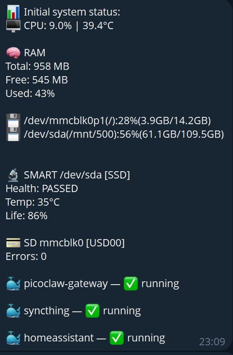

# bpimon

[](https://github.com/Kovalenkoyo81/bpimon/actions/workflows/ci.yml)
[](https://go.dev)
[](LICENSE)

Lightweight Telegram bot for basic Linux system monitoring. Originally built for single-board computers (Raspberry Pi, Orange Pi, Banana Pi), but works on any Linux machine — server, VPS, or desktop.

Monitors CPU, RAM, disk, SMART drives, SD cards, and Docker containers. Sends alerts when thresholds are exceeded. Supports remote reboot/poweroff with confirmation.



## Features

- CPU usage and temperature
- RAM usage
- Disk usage per partition
- SMART drive health (temperature, life remaining)
- SD/MMC card error monitoring via kernel log
- Docker container status and remote restart
- Alert system with cooldown, silence control, and state persistence
- Remote reboot / poweroff with confirmation code
- Rate limiting and admin-only commands
- Works on any Linux SBC: arm64, armv7, armv6, amd64

## Prerequisites

- Go 1.25 or later — [install](https://go.dev/dl/)
- A Telegram bot token — create one via [@BotFather](https://t.me/botfather)
- Your Telegram chat ID — get it from [@userinfobot](https://t.me/userinfobot)
- Optional: `smartctl` for SMART monitoring (`apt install smartmontools`)
- Optional: `docker` CLI for container monitoring

## Quick start

### Option A: install script (recommended, no Go required)

Detects your architecture automatically, downloads the binary, and sets up the systemd service in one command.

```bash
export BPIMON_TELEGRAM_TOKEN=your_bot_token
export BPIMON_TELEGRAM_CHATID=your_chat_id    # negative number for group chats
export BPIMON_TELEGRAM_ADMINS=123456789        # your Telegram user ID
curl -fsSL https://github.com/Kovalenkoyo81/bpimon/releases/latest/download/install.sh | sudo -E bash
```

After installation, edit the config to match your hardware and restart:

```bash
nano /etc/bpimon/config.yaml
systemctl restart bpimon
```

That's it — bot is running. Skip to [Check it works](#4-check-it-works).

---

**Or build from source:**

| | Cross-compile | Local build |
|---|---|---|
| **How** | Build on your laptop, upload to server | Build directly on the server |
| **Best for** | Slow boards: Raspberry Pi Zero, Pi 1, Pi 2 | Faster boards: Pi 3/4/5, Orange Pi, Banana Pi |
| **Requires Go on** | Your laptop/desktop | The server itself |
| **Build time** | Seconds | Minutes (or longer on slow boards) |

→ [Cross-compile from another machine](#managing-from-another-machine-optional) — recommended for slow or resource-constrained boards.

→ Continue below for local build.

### 1. Clone

```bash
git clone https://github.com/Kovalenkoyo81/bpimon.git
cd bpimon
cp config.yaml.example config.yaml
```

### 2. Configure

Open `config.yaml` and set your devices. Everything else can stay at defaults:

```yaml
devices:
  smart:
    - /dev/sda        # remove if no external drives
  docker:
    - my-container    # list your Docker containers, or remove section
```

### 3. Install

Set your Telegram credentials and run the installer:

```bash
export BPIMON_TELEGRAM_TOKEN=your_bot_token
export BPIMON_TELEGRAM_CHATID=your_chat_id    # negative number for group chats
export BPIMON_TELEGRAM_ADMINS=123456789        # your Telegram user ID
sudo -E make install
```

The installer builds the binary, installs it to `/usr/local/bin`, stores credentials in `/etc/bpimon/env` (mode `600`, readable only by root), and starts the service. You only need to set these variables once — they are saved on the machine and survive reboots.

### 4. Check it works

```bash
make status
make logs
```

---

## Managing from another machine (optional)

**Recommended for slow or resource-constrained boards** (Raspberry Pi Zero, Pi 1, Pi 2, any board where compiling takes too long). Build on your laptop or desktop in seconds, upload the ready binary via SSH.

```bash
# Set credentials in your current shell session
export BPIMON_TELEGRAM_TOKEN=your_bot_token
export BPIMON_TELEGRAM_CHATID=your_chat_id
export BPIMON_TELEGRAM_ADMINS=123456789

# Deploy (cross-compiles and uploads via SSH)
make deploy SERVER=user@your-sbc-ip
```

Default target architecture is `linux/arm64`. For other boards:

```bash
make deploy SERVER=user@host GOARCH=arm GOARM=7   # Raspberry Pi 2/3, Orange Pi, Banana Pi (armv7)
make deploy SERVER=user@host GOARCH=arm GOARM=6   # Raspberry Pi 1, Zero
make deploy SERVER=user@host GOARCH=amd64         # x86_64
```

Check status and logs remotely:

```bash
make status SERVER=user@your-sbc-ip
make logs   SERVER=user@your-sbc-ip
```

---

## Configuration reference

| Field | Default | Description |
|-------|---------|-------------|
| `telegram.enabled` | `true` | Enable Telegram bot |
| `thresholds.cpu` | `85` | CPU usage alert threshold (%) |
| `thresholds.cpu_temp` | `70` | CPU temperature alert threshold (°C) |
| `thresholds.ram` | `90` | RAM usage alert threshold (%) |
| `thresholds.disk` | `85` | Disk usage alert threshold (%) |
| `thresholds.smart_temp` | `55` | SMART drive temperature threshold (°C) |
| `thresholds.smart_life` | `20` | SMART drive remaining life threshold (%) |
| `thresholds.interval_min` | `2` | Alert check interval (minutes) |
| `thresholds.cooldown_min` | `30` | Minimum time between repeated alerts (minutes) |
| `devices.smart` | `[]` | Block devices to monitor with SMART (e.g. `/dev/sda`) |
| `devices.mmc` | `[]` | SD/MMC devices to monitor (e.g. `mmcblk0`). Auto-discovered if omitted. |
| `devices.docker` | `[]` | Docker containers to monitor |

### Environment variables

| Variable | Description |
|----------|-------------|
| `BPIMON_TELEGRAM_TOKEN` | Bot token from @BotFather |
| `BPIMON_TELEGRAM_CHATID` | Target chat ID (negative for group chats) |
| `BPIMON_TELEGRAM_ADMINS` | Comma-separated list of admin user IDs |

## Bot commands

| Command | Description |
|---------|-------------|
| `/status` | Full system status |
| `/cpu` | CPU usage and temperature |
| `/ram` | RAM usage |
| `/disk` | Disk usage per partition |
| `/smart` | SMART drive health |
| `/sd` | SD card error status |
| `/docker` | Docker container status |
| `/restart <name>` | Restart a Docker container (confirmation required) |
| `/reboot` | Reboot the server (confirmation required) |
| `/poweroff` | Shut down the server (confirmation required) |
| `/silence <minutes>` | Silence alerts for N minutes |
| `/silence off` | Resume alerts |
| `/silence` | Show current silence status |
| `/help` | Show command list |

Admin commands (`/restart`, `/reboot`, `/poweroff`, `/silence`) require the sender's ID to be listed in `BPIMON_TELEGRAM_ADMINS`.

## Makefile reference

```bash
make install            # build natively and install on this machine (run on the SBC)
make status             # systemctl status (local)
make logs               # last 50 log lines (local)
make follow             # live log stream (local)

make deploy SERVER=...  # cross-compile and deploy to a remote machine
make status SERVER=...  # systemctl status on remote machine
make logs   SERVER=...  # last 50 log lines from remote machine
make follow SERVER=...  # live log stream from remote machine

make build              # cross-compile binary only
make test               # run tests
make vet                # run go vet
```

Key variables: `SERVER`, `GOOS`, `GOARCH`, `GOARM`. `VERSION` is auto-detected from the latest git tag.

## Troubleshooting

**Bot doesn't respond**
Check that the bot is running (`make status`) and that you sent the message to the correct chat. In group chats, the bot must have access to messages — disable privacy mode via @BotFather (`/setprivacy → Disable`).

**"SMART unavailable"**
Install smartmontools: `apt install smartmontools`. The bot skips SMART silently if `smartctl` is not found.

**"docker not found"**
The bot skips Docker monitoring if the `docker` CLI is not in PATH. Make sure docker is installed and accessible by root.

**No temperature reading**
Some boards expose CPU temperature under non-standard thermal zone names. The bot searches for zones named `cpu`, `soc`, `arm`, `pkg`, `core`. If your board uses a different name, open an issue.

**Chat ID is wrong**
Group chat IDs are negative numbers. Forward any message from the group to [@userinfobot](https://t.me/userinfobot) to get the correct ID.

## License

MIT — see [LICENSE](LICENSE)
